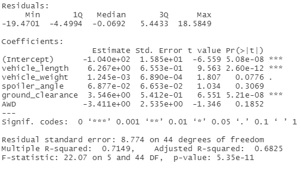
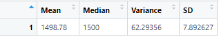
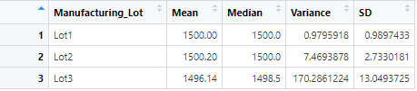
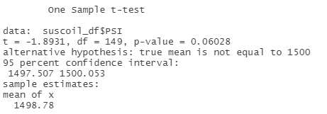
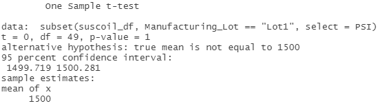
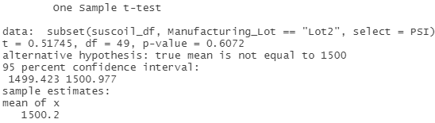
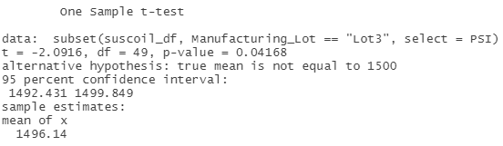

# MechaCar_Statistical_Analysis

## Contents
- [Overview of the Project](#overview)
- [Files](#files)
- [Linear Regression to Predict MPG](#linear-regression-to-predict-mpg)
- [Summary Statistics on Suspension Coils](#summary-statistics-on-suspension-coils)
- [T-Tests on Suspension Coils](#t-tests-on-suspension-coils)
- [Study Design: MechaCar vs Competition](#study-design-mechacar-vs-competition)

## Overview
The purpose of this analysis is to review production data of MechaCar to provide insights that may help the manufacturing team understand the reason behind production issues. The analysis involves performing multiple linear regression to understand variables impacting MPG, and T-tests to determine if a certain lot is significantly different from the overall population.

## Files
- MechaCarChallenge.R - Contains R code for Linear regression analysis and T-tests

## Linear Regression to Predict MPG

Null Hypothesis: None of the variables impact MPG
Alternate Hypothesis: One or more variables directly impact fuel economy

Assume p-value of 0.05

Results:

1. Results of the linear regression analysis show that vehicle length and ground celarance are the only two variables that imapct fuel economy. the null hypothesis can thus be rejected.
2. Slope in this case cannot be zero as there are two variables that are shown to impact fuel economy. 
3. R-value of 0.71 indicates that the model is effective in predicting mpg. However, a non-zero intercet that is statistically significant indiacates that the fuel economy cannot be fully explained by the analyzed variables alone.

## Summary Statistics on Suspension Coils

### All Lots
Image below shows the variance considering all the lots meets the design specifications.

### Individual Lots

Analysis of statistics by individual ots shows that Lot 3 variance is outside of design specifications. 

## T-Tests on Suspension Coils

T-tests are used to deterine whether the means of two groups are equal to each other. The null hypothesis is that the two means are equal, and the alternative is that they are not. Assuming a confidence level of 0.05, the null hypothesis in this case cannot be rejected (p-value = 0.0628). This means that the difference in means is purely random.

From the above images, it can be seen that the Lot 3 is the only lot where the null hypothesis cannot be rejected. 

## Study Design: MechaCar vs Competition
Several metrics are of importance to a consumer when purchasing a car. To determine performance against competition, a factorial ANOVA test can simultaneously determine the impact of several variables on sales.

Metrics:
Independent variables: City MPG, safety rating, horsepower
Dependent variable: Car sales

Hypothesis:
H0: Sales is independent of chosen metrics
Ha: Sales depends on chosen metrics

Required Data:
To conduct the factorial ANOVA test, we'll need to collect car sales data across different competitors along with other relevean information including city MPG, safety rating andf horsepower.  

